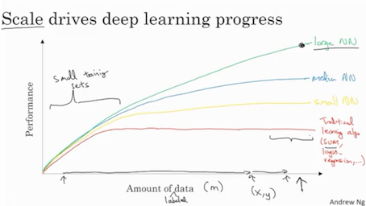
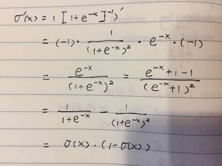
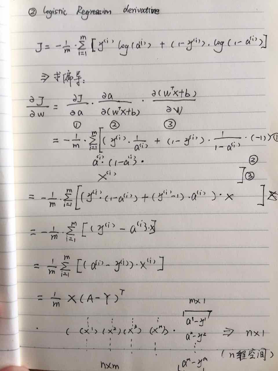

### DNN-NG

##### Supervised Learning DNN
* Pregression & Classification: Standard DNN
* Images: CNN
* Sequence (Audio) & Language: RNN
* Driving: Custom, Hybrid

##### Structure
* Structured Data: Database
* Unstructed Data (DNN do good): Audio, Radio, Text

##### Why Deep Learning taking off
* Scale - NN size
* Scale - data size
* Algorithms - Relu
* Computation - Fast

##### Compare

##### sigmoid's derivative

##### cost function derivative respect to weight

##### Activation Function
1. classification: sigmoid as output layer
2. tanh is always better than sigmoid

##### Derivative
* sigmoid: sigmoid*(1-sigmoid)
* tanh: 1-tanh^2

##### initialize
* all the hidden layer node will be the same
