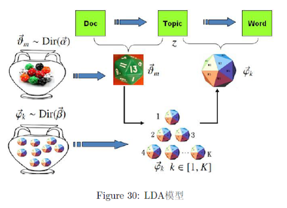
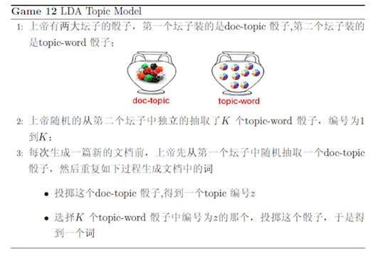
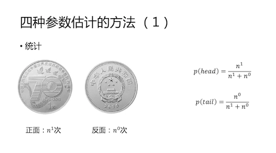
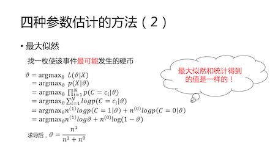
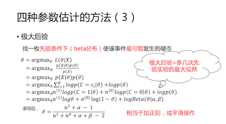
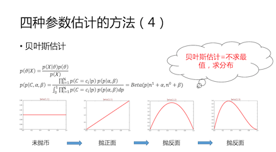
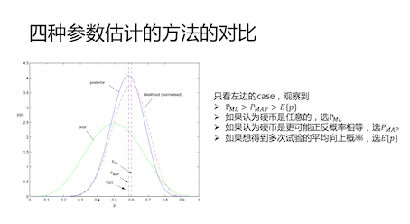
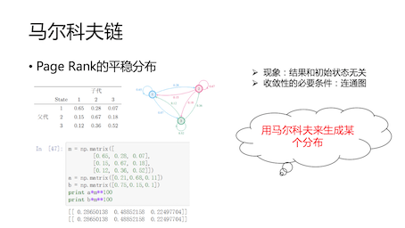
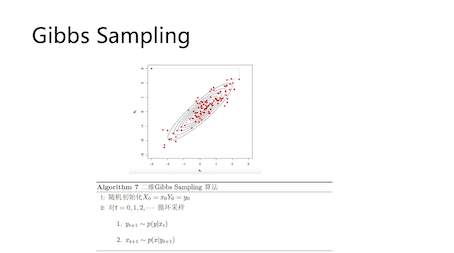
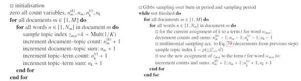

* 痛点 
“乔布斯离我们而去了” 和 “苹果什么时候降价”如何关联？
* 思路
  * 将word映射到topic维度 
   
  * 概率表示 
   
   
* 演进：Unigram Model 
   
* 演进：Bayes Unigram Model 
   
* 演进：PLSA 
   
   
* 演进：LDA 
   
   
* 参数估计：统计 
   
* 参数估计：似然 
   
* 参数估计：后验 
   
* 参数估计：贝叶斯 
   
* 参数估计：对比 
   
* 马尔可夫链条 
   
* 吉布斯采样 
   
* 实现代码 
   
* Ref: 
  * Parameter estimation for text analysis （http://www.arbylon.net/publications/text-est.pdf）
  * LDA数学八卦
  * LDA简介 http://blog.csdn.net/huagong_adu/article/details/7937616
  * Gibbs采样 https://www.youtube.com/watch?v=a_08GKWHFWo

