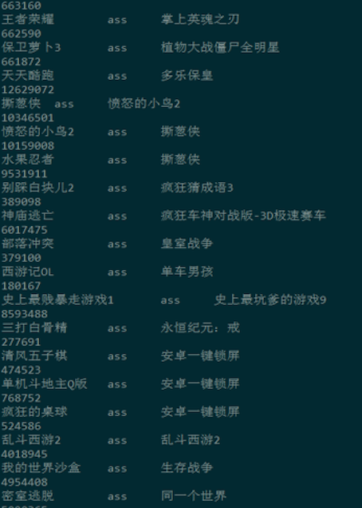

#### 理论
* **痛点**<br>
“乔布斯离我们而去了” 和 “苹果什么时候降价”如何关联？
* **思路**
  * 将word映射到topic维度<br>
  <br>
  * 概率表示<br>
  <br>
  <br>
* **演进：Unigram Model**<br>
  <br>
* **演进：Bayes Unigram Model**<br>
  <br>
* **演进：PLSA**<br>
  <br>
  <br>
* **演进：LDA**<br>
  <br>
  <br>
* **参数估计：统计**<br>
  <br>
* **参数估计：似然**<br>
  <br>
* **参数估计：后验**<br>
  <br>
* **参数估计：贝叶斯**<br>
  <br>
* **参数估计：对比**<br>
  <br>
* **马尔可夫链条**<br>
  <br>
* **吉布斯采样**<br>
  <br>
* **实现代码**<br>
  <br>
* **Ref:**<br>
  * Parameter estimation for text analysis （http://www.arbylon.net/publications/text-est.pdf）
  * LDA数学八卦
  * LDA简介 http://blog.csdn.net/huagong_adu/article/details/7937616
  * Gibbs采样 https://www.youtube.com/watch?v=a_08GKWHFWo

#### 实践
* 基础数据
  * 豌豆荚软件的描述信息
  * 星级>3星
  * 下载数>100
  * 安装数>100
  * 用户数>100
* 目的
  * 得到基于内容（描述）的item2item
  * 得到“词--主题--包名” 的关系
* 代码
  * [lda_code](../NLP/LDA原理和实践/README.md)


* LDA工具<br>
  https://github.com/liuzhiqiangruc/dml/tree/master/tm
* 获取数据<br>
```
hive -e "
select a.user_id, a.item_id, a.preference
from
(
   ...
)
" > input_lda
```

* 数据概况
  * 基础数据获取：见hql
  * 数据整理：cat input_lda | awk -F"\t" '{ print $1"\t"$2 }' > input
  * 数据形式：user_id \t item_id （后期可考虑tf-idf优化）
  * 行数：1849296
  * 用户数：678588
  * 游戏数：3377
* 运行命令
```
./lda -a 0.2 -b 0.01 -k 50 -n 1000 -s 100 -d ./input -o ./output

    参数说明:
     --------------------------------------------
           -t               算法类型1:基本lda，2:lda-collective，3:lda_time
           -r               运行模式，1:建模，2:burn-in
           -a               p(z|d) 的 Dirichlet 参数
           -b               p(w|z) 的 Dirichlet 参数
           -k               Topic个数
           -n               迭代次数
           -s               每多少次迭代输出一次结果
           -d               输入数据
           -o               输出文件目录,实现需要存在

  运行时长：10分钟左右
```
* 关联名称<br>
  * 处理word_topic矩阵，将ID和名称关联起来，为lda.csv
```
Hql如下，
set hive.exec.compress.output=false;
create table xxxx
(
    id  int
) row format delimited
fields terminated by '\t';

load data local inpath '/output/f_word_topic' OVERWRITE  into table xxxx;
```
* Item2Item计算
```
mport sys
import math
import heapq

items_D = {} ## key: id

def load_data():
    global items_D
    inFp = open("lda_norm_10.csv", 'r')
    while True:
        line = inFp.readline()
        if not line:
            break
        items = line.strip().split(',')
        if len(items) != 54:
            continue
        item_D = {}
        item_D['soft_package_name'] = items[0]
        item_D['name'] = items[1]
        item_D['id'] = int(items[2])
        item_D['topics'] = map(float, items[3:53])
        item_D['sum'] = float(items[53])
        items_D[item_D['id']] = item_D


def dis1(A, B):
    return sum( A['topics'][i] * B['topics'][i] for i in range(50))

def dis2(A, B):
    return sum( 100 - abs(A['topics'][i] - B['topics'][i]) for i in range(50))

def search_similar():
    while True:
        line = sys.stdin.readline()
        idx = int(line.strip())
        itemX = items_D[idx]
        sim = -1.0
        for idy, itemy in items_D.items():
            simy = dis1(items_D[idx], items_D[idy])
            if (simy > sim or sim < 0) and idx!=idy:
                sim = simy
                itemY = itemy
        print "%s\tass\t%s"%(itemX['name'], itemY['name'])

load_data()
search_similar()
```

* 效果展示<br>
<br>

* doc2topic<br>
<br>

* topic2word<br>
<br>

* 矩阵分解图谱<br>
<br>

* 生成模型 VS 判别模型
  * 判别方法：由数据直接学习决策函数Y=f(X)或者条件概率分布P(Y|X)作为预测的模型，即判别模型。
  * 生成方法：由数据学习联合概率密度分布P(X,Y)，然后求出条件概率分布P(Y|X)作为预测的模型，即生成模型：P(Y|X)= P(X,Y)/ P(X)

