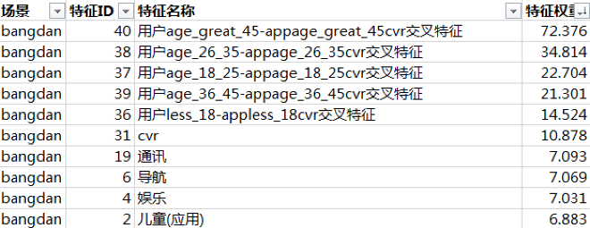
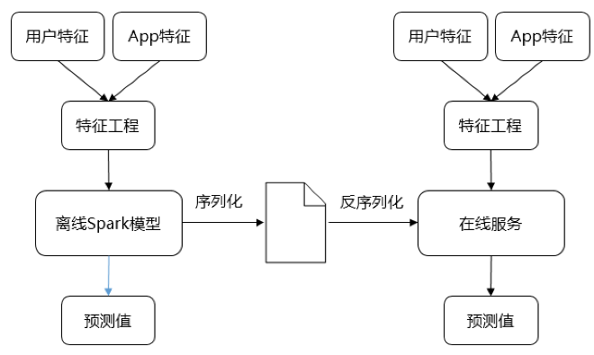
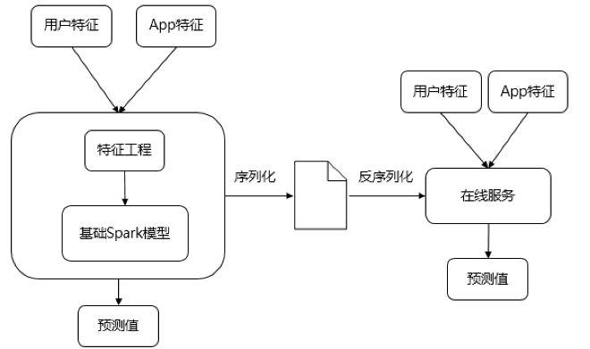
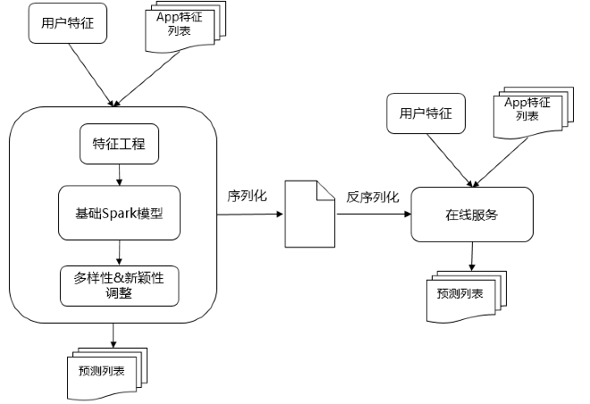

离线在线打通，有如下几种方案

##### 方案一：结果传递
* 方案 
典型的Item-cf离线推荐，即是离线挖掘的结果，完整写入Cache中提供给在线服务使用，算法在离线侧，算法结果在在线侧，整个算法对在线完全透明。

* 痛点 
    * 不可以实时化（模型实时化，特征实时化均不可）
    * 通常是天级别（最快小时级别）更新的
    * 覆盖率痛点，无法覆盖全量用户（尤其是新用户）

##### 方案二：枚举传递 
第一期的时候，为了实现快速迭代，采用了简单的枚举的方案。枚举的字段是，场景＋用户性别分段＋用户年龄分段。 
* 例子 
    * 场景1，男性，18-25岁：微信，陌陌，微博，今日头条等 
    * 场景2，女性，<18岁：天天爱消除，贪吃蛇大作战，王者荣耀等 
    * 场景有x个，场景1，场景2，场景3等 
    * 性别有3种：男，女，未知 
    * 年龄有6种：<18, 18-25, 26-35, 36-45, 45以上 
    * 枚举的行数有3*6*4=72个 
    * 将72个枚举导入Dcache进行在线的服务即可。 

* 痛点
随着场景的增加特征的增加，逐渐的枚举量太大了，Dcache的容量有限。例如加入了30个软件类型0/1特征，2^30很容易撑爆Dcache.

##### 参数打通
* 方案 
    * 为了解决枚举过多的痛点，可以将参数放到线上，每次线上实时去计算推荐列表。第一期采用LR的模型，把LR的权重参数传递到mysql中，如下图展示了top10权重的特征 
      
    * 并且把app特征也放到mysql db中。
    * 在离线和在线定义同一套app feature和user feature交叉的特征工程方法，实现线上排序

* 痛点 
当尝试更多的模型的时候（如GBDT, GBDT+LR等），模型过于复杂，通过暴露参数的方法已经不能在线上实现模型了。

##### 原始特征+模型打通
* 方案 
    1. 训练feature传递，单值返回 
     
    **痛点:** 
    离线侧和在线侧要实现两套同样的特征工程逻辑，每次都要对齐比较繁琐，是可以优化的点。
    2. 原始feature传递，单值返回 
     
    **痛点** 
    app推荐的多样性和新颖性非常的重要，往往在最顶层需要对多样性和新颖性进行排序，让列表更加整体，更新信息更丰富。
    3. 原始feature传递，列表返回 
     

##### 特征实时化
实时特征的获取，对用户的场景把控更准确。

##### 模型实时化
在线训练，更快捕捉模型的变化
