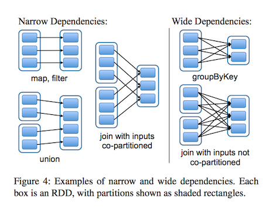
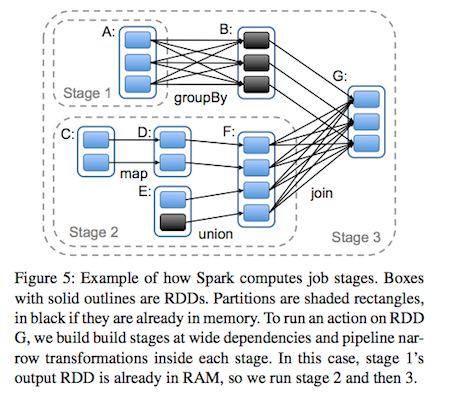

##### Motivated
   * Iterative algorithms
   * Interactive data mining tools

##### Reuse Intermediate
   * Data Reuse: PageRank, K-means
   * Interactive Data Mining: adhoc querys

##### Between MR jobs
   * data replication
   * dist I/O
   * serialization

##### Frameworks
   * Pregel
   * HaLoop

Specific Patterns, not General

##### RDDs
   * fault-tolerant
   * parallel data structure

##### In-memory storage on clusters
   * distributed shared memory
   * key-value stores
   * databases

##### Challenge: Fault Tolerance
   * Replicate the data across machines
   * Log updates across machines

Bandwidth is far lower than RAM

##### Interface
   * Coarse-grained Transformations: map, filter, join
   * build a dataset rather than the actual data

##### Programming
   * MapReduce
   * SQL
   * Pregel
   * HaLoop

##### RDD
   * features
      * read-only
      * partitioned
   * create
      * data in stable storage
      * other RDDs
   * transformations
      * map
      * filter
      * join
   * lineage
      * not materialized at all times
      * information about how to derived from stable storage
   * control
      * persistence
      * partitioning
         * join: hash-partitioned in the same way
   * Programming
      * transformations: map, filter
      * actions: count, collect
      * save
      * persist

##### Advantages
   * backup tasks
   * data locality
   * degrade

##### App Not Suitable
   * Best Suit: batch app, same operation to all elements
   * Not Suit: asynchronous fine-grained updates

##### RDD Operations
   * Transformations and Actions
   * map: one to one
   * flatMap: one to more
   * groupByKey
   * reduceByKey
   * sort

##### dependencies
   * narrow: map, pipline like, failure -> lost parents to be recomputed
   * wide: join, mapreduce like, failure -> all ancestors to be recomputed

 
 

##### Memory Management
   * LRU

##### Checkpoint
   * api
   * auto

##### REF
   * Resilient Distributed Datasets: A Fault-Tolerant Abstraction for
In-Memory Cluster Computing 

