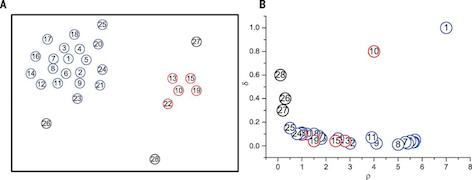

### Clustering by fast search and find of density peaks

* **文章来源** 
发表在science上 
网址：http://www.sciencemag.org/content/344/6191/1492.short

* **两个观点** 
  * 密度观点：聚类中心点的密度比临近点密度都大
  * 距离观点：聚类中心与比他们密度更大的点的距离都比较大

* **观点图示** 
  * Fig A：点的分布，并且已经按照密度排序。 
  * Fig B：密度值和距离值的二维图 

{ width=50%}

