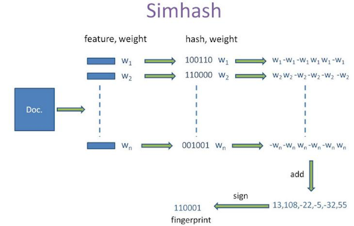

#### LSH
LSH主要有simhash和minhash

##### simhash-Problem
有很多网页，需要做很多网页的比较工作，工作量很大，如何减少工作量？

##### simhash-Try to solve
* 方案一：将网页直接hash？ 
    能够比较两个网页是否完全相同，不能计算出相似程度。
* 方案二：计算cos距离？ 
    有N个网页，每个网页M个词语，复杂度为O(N*N*M)，计算量太大。

##### simhash-思路
将网页hash成为一个K位的值，并且网页越相似，hash值越相似，即simhash。

##### simhash-解决方案

##### simhash-解决方案

##### simhash-解决方案

##### Why
* 试着做很小的修改？     很难影响fingerprint。
* 权重越大？       对fingerprint的影响越大。
* 尝试：让权重=TF-IDF值

##### Simhash 替代 hash？
不可，破坏了hash要求的随机性。 
签名：容易错误。

##### Ref 
* http://blog.csdn.net/heiyeshuwu/article/details/44117473
* https://leons.im/posts/a-python-implementation-of-simhash-algorithm/

