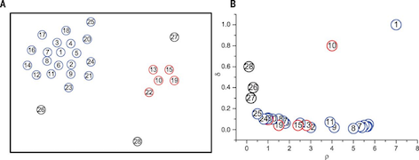
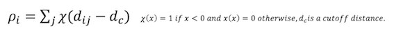
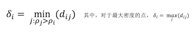
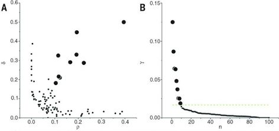
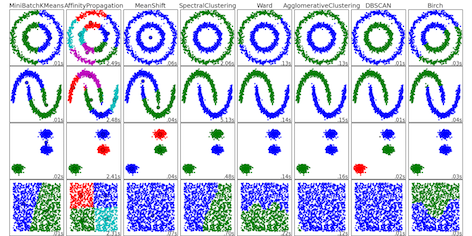

### Clustering by fast search and find of density peaks

* **文章来源** 
发表在science上 
网址：http://www.sciencemag.org/content/344/6191/1492.short

* **两个观点** 
  * 密度观点：聚类中心点的密度比临近点密度都大
  * 距离观点：聚类中心与比他们密度更大的点的距离都比较大

* **观点图示** 
  * Fig A：点的分布，并且已经按照密度排序。 
  * Fig B：密度值和距离值的二维图 

    

* **召回方案**
  * 密度观点召回：召回了密度中心和靠近密度中心的点。
  * 距离观点召回：召回了离群点和密度中心点。
  * 密度召回∩距离召回：召回密度中心点

* **计算方法**
  * 密度值 
    

  * 距离值 
    

* **综合指标**
  * 可以合并两个指标，作为最终指标
  * 例如：𝛾=𝜌*𝛿 
    

* **复杂度**
  * 时间复杂度：
	O(m*n^2)
  * 空间复杂度：
	O(m*n^2)

* **一些聚类算法的比较**
  * No Free Lunch: 没有最好的聚类方法，只有最合适的。 
   

* **和dbscan比较**
  * 当有渐变噪声的时候，dbscan很难找到合适的密度，去聚出这两个类，但是本算法可以 
  