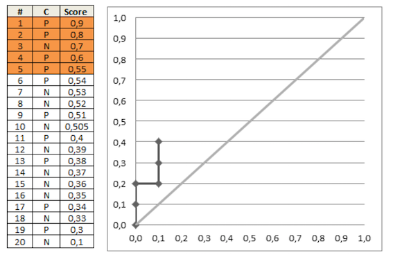

* **ROC曲线和AUC**<br>
<br>

* **计算方法**<br>
auc计算部分，除了画出roc曲线，还可以直接计算：<br>
  <br>
  其中,
   * M为正类样本的数目，N为负类样本的数目<br>
   * rank是用的tiedrank

* **原理**<br>
和Wilcoxon-Mann-Witney Test有关，即:<br>
auc=“测试任意给一个正类样本和一个负类样本，正类样本的score有多大的概率大于负类样本的score”，也即auc的物理意义。<br>

* **单机计算**<br>
参考：https://github.com/liuzhiqiangruc/dml/blob/master/regr/auc.c

* **hive计算**<br>
使用hivemall可以方便地计算auc, 如下图<br>
<br>

* **spark计算**<br>

```

// Compute raw scores on the test set
val predictionAndLabels = test.map { case LabeledPoint(label, features) =>
  val prediction = model.predict(features)
  (prediction, label)
}

// Instantiate metrics object
val metrics = new BinaryClassificationMetrics(predictionAndLabels)

// AUROC
val auROC = metrics.areaUnderROC
println("Area under ROC = " + auROC)

```

* **AUPR**<br>
  * AUPR：Area Under Precision Recall Curve<br>
  <br>

* **AUC VS AUPR (1)**<br>
 <br>

* **AUC VS AUPR (2)**<br>
<br>

* **Ref:**<br>
1. http://taoo.iteye.com/blog/760589
2. http://cn.mathworks.com/help/stats/tiedrank.html?requestedDomain=www.mathworks.com
3. https://github.com/liuzhiqiangruc/dml/blob/master/regr/auc.c