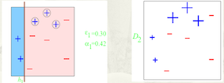
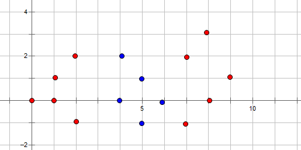
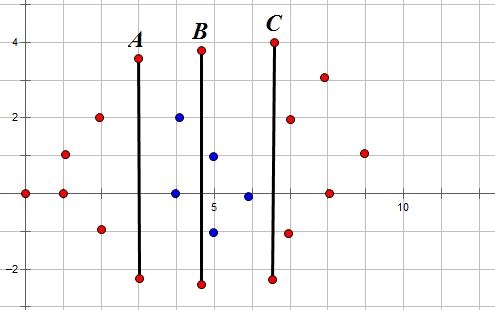

### 从adaboosting到bias的重要性和非线性能力的实现

精准推荐是商业化的重要能力，而分类能力是精准推荐的基础。

#### 集成学习

集成学习有两种方法，bagging, boosting和stacking。<br>
adaboosting全称adaptive boosting（自适应调节的boosting，属于十大机器学习算法之一）

集成学习：集成学习就是一堆弱分类器一起共同努力，拼凑成一个强分类器，团结的力量就是大。<br>
（有理论证明弱学习算法（正确率超过50%即可）可以组合提升为强学习算法（多棵决策树有用的原因：一棵准确率0.6，三棵准确率0.6^3+0.6^2*0.4*3=0.648...  ）
   既然一堆分类器想要集成，那么就有投票权力的分配问题了。

#### 投票方法
一人一票制度：一堆分类器一人一票制度投票，来决定分类结果。如bagging和random forest的方法。

一人多票制度：一堆分类器，根据分类器的好坏，好分类器多分给他几票，差分类器少分给他几票。如boosting的方法。

#### 抽样方法
样本等概率    VS    样本不等概率<br>
全部样本  VS 部分样本<br>
重复抽样 VS 不重复抽样<br>

#### adaboosting
adaboosting在里面的位置，属于：一人多票制度+样本不等概率+全部样本+不重复抽样

#### 弱分类器
adaboosting对其弱分类器的要求不高，所以我们采用最简单的decision stump的方法，即只有一层的决策树。

#### 训练流程
<br>

#### demo实现
```
import math

class sample(object):
    def __init__(self, feature, label, weight):
        self.feature = feature
        self.label = label
        self.weight = weight

class stump(object):
    def __init__(self, dimension, sample_L):
        self.dimension = dimension
        self.threshold = None
        self.leftLabel = None
        self.rightLabel = None
        self.error_rate = None
        self.weight = None
        self.leftLabel_x = None
        self.rightLabel_x = None
        self.sample_L = sample_L
        self.total_error = sum([sample_x.weight for sample_x in sample_L])

        ## get the best threshold ##
        for sample_x in sample_L:
            threshold_x = sample_x.feature[self.dimension]
            error_rate_x = self.getErrorRate(threshold_x)
            if self.error_rate is None or self.error_rate > error_rate_x:
                self.threshold = threshold_x
                self.leftLabel = self.leftLabel_x
                self.rightLabel = self.rightLabel_x
                self.error_rate = error_rate_x
        self.weight = self.getWeight()

    def getWeight(self):
        return 0.5*math.log((1-self.error_rate)/max(self.error_rate, 0.0001))

    def getErrorRate(self, threshold_x):
        left_1_error = 0.0
        left_0_error = 0.0
        right_1_error = 0.0
        right_0_error = 0.0
        ## get left errors ##
        for sample_y in self.sample_L:
            if sample_y.feature[self.dimension] <= threshold_x:
                if sample_y.label == -1:
                    left_1_error += sample_y.weight
                else:
                    left_0_error += sample_y.weight
            else:
                if sample_y.label == -1:
                    right_1_error += sample_y.weight
                else:
                    right_0_error += sample_y.weight
        ## get error and labels ##
        if left_1_error < left_0_error:
            self.leftLabel_x = 1
        else:
            self.leftLabel_x = -1
        if right_1_error < right_0_error:
            self.rightLabel_x = 1
        else:
            self.rightLabel_x = -1
        return (min(left_1_error, left_0_error) + min(right_1_error, right_0_error))/self.total_error

    def reWeightSample(self):
        for i in range(len(self.sample_L)):
            if (self.sample_L[i].feature[self.dimension] <= self.threshold and self.leftLabel == self.sample_L[i].label) \
                or (self.sample_L[i].feature[self.dimension] > self.threshold and self.rightLabel == self.sample_L[i].label):
                self.sample_L[i].weight *= math.sqrt(self.error_rate/max(1-self.error_rate, 0.0001))
            else:
                self.sample_L[i].weight *= math.sqrt((1-self.error_rate)/max(self.error_rate, 0.0001))

    def predict(self, sample_x):
        if sample_x.feature[self.dimension] <= self.threshold:
            return self.leftLabel
        else: return self.rightLabel

nWeak = 3
nSample = -1
sample_L = []
stump_L = []

def run():
    ## input data ##
    inFp = open("sample", 'r')
    nSample = int(inFp.readline().strip())
    while True:
        line = inFp.readline()
        if not line:
            break
        item = map(int, line.strip().split("\t"))
        sample_x = sample(item[1:], item[0], 1.0/nSample)
        sample_L.append(sample_x)
    inFp.close()

    ## train weak classfier ##
    for t in range(nWeak):
        dimension = t % 2
        stump_x = stump(dimension, sample_L)
        stump_x.reWeightSample()
        print "...."
        print "the dimension is %d"%stump_x.dimension
        print "the threshold is %.9f"%stump_x.threshold
        print "the leftLabel is %d"%stump_x.leftLabel
        print "the rightLabel is %d"%stump_x.rightLabel
        print "the error_rate is %.9f"%stump_x.error_rate
        print "the weight is %.9f"%stump_x.weight
        print [sample_x.weight for sample_x in sample_L]
        stump_L.append(stump_x)

    ## predict ##
    for sample_x in sample_L:
        predict_one = 0
        for stump_x in stump_L:
            predict_one += stump_x.weight*stump_x.predict(sample_x)
        if predict_one > 0:
            print "predict is 1"
        else:
            print "predict is -1"

if __name__ == "__main__":
    run()
```

测试样例<br>
```
10
1       1       3
1       2       2
-1      3       2
-1      4       3
1       5       4
1       6       6
-1      6       3
1       7       4
-1      8       2
-1      8       5
```

输出
```
the dimension is 0
the threshold is 2.000000000
the leftLabel is 1
the rightLabel is -1
the error_rate is 0.300000000
the weight is 0.423648930
[0.06546536707079773, 0.06546536707079773, 0.06546536707079773, 0.06546536707079773, 0.15275252316519466, 0.15275252316519466, 0.06546536707079773, 0.15275252316519466, 0.06546536707079773, 0.06546536707079773]
....
the dimension is 1
the threshold is 3.000000000
the leftLabel is -1
the rightLabel is 1
the error_rate is 0.214285714
the weight is 0.649641492
[0.12535663410560177, 0.12535663410560177, 0.03418817293789139, 0.03418817293789139, 0.07977240352174655, 0.07977240352174655, 0.03418817293789139, 0.07977240352174655, 0.03418817293789139, 0.12535663410560177]
....
the dimension is 0
the threshold is 7.000000000
the leftLabel is 1
the rightLabel is -1
the error_rate is 0.136363636
the weight is 0.922913345
[0.049811675413689895, 0.049811675413689895, 0.08603834844182799, 0.08603834844182799, 0.031698338899620836, 0.031698338899620836, 0.08603834844182799, 0.031698338899620836, 0.01358500238555179, 0.049811675413689895]
predict is 1
predict is 1
predict is -1
predict is -1
predict is 1
predict is 1
predict is -1
predict is 1
predict is -1
predict is -1
```

#### 示意图
<br>
<br>
<br>


#### 一个特殊的训练样本
<br>

#### 一些特殊的decision stump<br>
选择三颗树（上文中的代码需要五棵树，因为其交叉选取xy作为decision stump的threshold）就能训练出来，如图所示：<br>
<br>


树A：左侧红（-1分），右侧蓝（+1分）

树B：左侧红（-1分），右侧红（-1分）

树C：左侧蓝（+1分），右侧红（-1分）

最后得到，

A左侧：-1-1+1=-1（红）

A~B:+1-1+1=1 （蓝）

B~C: +1-1+1=1（蓝）

C右侧：+1-1-1=-1（红）

即正确的分类，其中有一棵树比较奇怪，即树B的右侧和左侧同时判断为红色。看起来没有什么用处，但正是这个bias的特点，保证了在这个训练集的非线性能力的实现。

#### bias
我的理解是，bias叫偏好，或者截距（类似于y=kx+b里的b）

#### 神经网络的非线性能力和bias

神经网络的基本能力是其逻辑运算的能力，即“与”、“或”、”非“的能力。

<br>
<br>
<br>

异或运算=(!a&b)||(a&!b)

即借助bias和sigmoid函数，求内积也可以具有逻辑运算能力，那就赋予了其解决非线性问题的能力。

svm的非线性能力和kernal

svm的解决非线性问题是kernel的方法。

LR的非线性能力和画段

LR解决非线性问题可以依靠对feature的画段的feature engineer.

最后，希望在手管的商业化进程中，数据挖掘能力能够协助手管做出一些对手管有益处，用户又不反感的手术刀般精准的商业变现能力。

能力有限，如有错误，欢迎和各位探讨.
