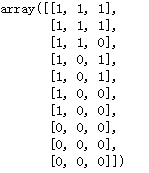
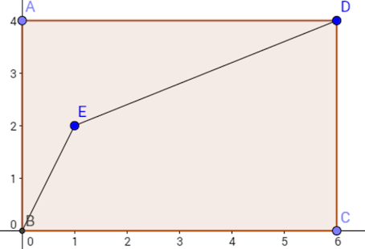
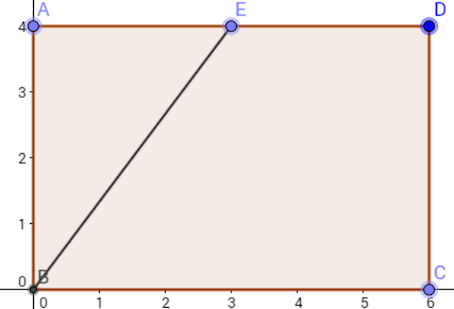
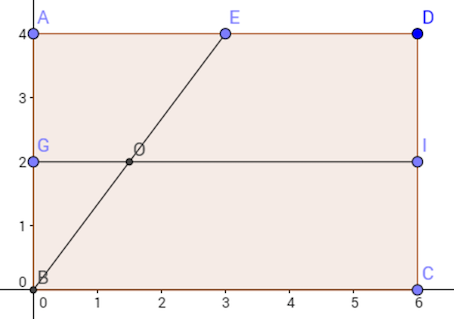
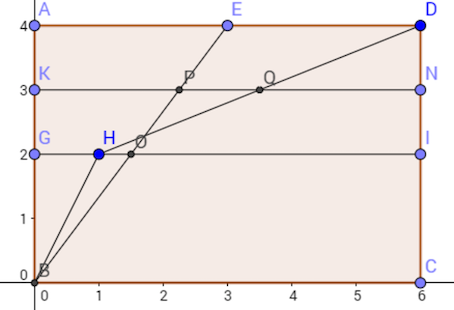

#### 问题 
特征的好坏衡量有很多的方法，如： 
 1. 单特征AUC
 2. 信息增益，信息增益率，gini index
 3. 相关系数 （label连续值）
 4. L1正则

但是，有些特征是低召回高精准的，即决策树中的某１子树集合很小很纯，另外１子树集合较大不纯。 

如类似于同事举的例子:

下图为三列为 金融理财标签，优惠券标签，是否点击

 

那么有： 
优惠券标签  
1– 覆盖率30%, ctr 66.7% (2/3)  
0– 覆盖率70%, ctr 28.6% (2/7)  

金融理财标签  
1– 覆盖率70%, ctr 57.1% (4/7)  
0– 覆盖率30%, ctr 0% (0/3)  

#### 单特征AUC
1. 优惠券标签的单特征roc曲线如下 
 
计算得到，auc=0.667 (16.0/24）
2. 金融理财的单特征roc曲线如下 
 
计算得到，auc=0.75 (18/24)
这样看金融理财是比优惠券标签要好的。

#### 定量投放
假如广告主买2个c，只考虑用单个特征的话：
1. 优惠券标签选择为1的投放，ctr=66.7%
2. 金融理财选择为1的投放，ctr=57.1%

这时，优惠券是比金融理财要好的。
假如广告主买3个c的话：
1. 优惠券选择为1的投放+选择一半0的投放，ctr=3/(3+3.5)=46.1%
2. 金融理财选择1的投放，ctr=57.1%

这时，选择金融理财是好的。

#### AUC分析
广告主买了2个c，使用金融理财的标签，在roc上的表现如下图 
 

广告主买了2个c，3个c和分别使用两种标签的roc表现如下图 
 

点H的fpr比点O的fpr低，所以买2个c优惠券的比金融理财的标签好；
点P的fpr比点Q的fpr低，所以买3个c金融理财的比优惠券的标签好。

#### 综合分析
两条roc曲线交叉的点，即是分界点。