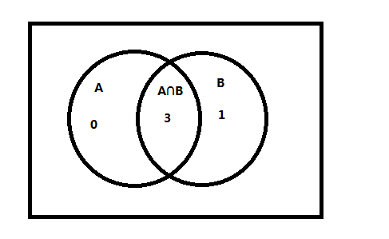
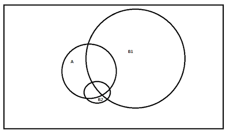

#### 1. 从购物篮到文式图

在常见的购物篮分析中，常常出现这样的数据：

| 购物篮 |
| :--- |
| A B |
| B C |
| A B C |
| A B |
| C D |
| D E |
| C E |

在讨论A和B的相似性的时候，用文式图可以方便的表示： 
 

那么A和B越相似的表现是：

1. 【频繁一项集】A和B的出现次数很多，数据充足有说服力，即频繁一项集大 1.1 count\(A\) = 3, count\(B\) = 4，这两个值足够大

2. 【support】A∩B的值很大，数据充足有说服力，表现为重合面积大，即频繁二项集大或者support高 2.1 频繁二项集 = count\(A∩B\) = 3，这个值越大越好 2.2 support = count\(A∩B\) / count\(ALL\) = 3 / 7，这个值越大越好

3. 【jaccard】A∩B的值在A∪B的中占比很大，有A就有B，表现为jaccard相似度高 3.1 jaccard\(A, B\) = count\(A∩B\) / count\(A∪B\) = 3/4 ，这个值越大越好

#### 2. 从文式图到行为关联

文式图应用到推荐往往是条件概率，求在先验下（使用A）后验的概率（使用B）是多少。 
 

【置信度】 如上图，可以计算置信度，值越大越相似： confidence\(B\|A\) = P\(B\|A\) = P\(使用B\|使用A\) = P\(A∩B\|A\) = P\(黄色\|黄色+浅蓝\) = 1.0

同理, （confidence可称conf） conf\(A\|B\) = 3/4

发现， conf\(B\|A\)和conf\(A\|B\)不同，说明conf是非对称的相似度； jaccard\(A, B\)和jaccard\(B, A\)相同，说明jaccard是对称的相似度。

【置信度的痛点】 但是推荐过程中，使用会出现偏热的现象，是因为后验B太热门导致的。 

 

A是用户的先验（比如是手管的app）； B1是一款热门软件（比如微信）； B2是一款相对冷门的软件（比如同步助手）；

可以发现由于B1的体量太大，导致conf\(B1\|A\)很大； 由于B2的体量较小，导致conf\(B2\|A\)偏小； 但是明显应该推荐B2，因为B2都快和A重合进去了，应该对B1的体量进行惩罚。

【提升度】 提升度是置信度B1体量惩罚的其中一种方法，含义为： 
 

lift\(B\|A\) = conf\(B\|A\) / P\(B\) = p\(A∩B\) \| \(P\(A\) \* P\(B\)\) = count\(A, B\) \* ALL / \(count\(A\) \* count\(B\)\) = \( 3 乘 7 \) / \(3 乘 4\) = 21/12

其中， lift等于1，表示先验知识A的知道与否对B的概率没有影响。 lift大于1，表示促进作用； lift小于1，表示抑制作用；

发现， lift\(A\|B\)=lift\(B\|A\)，即lift是对称的。

又发现， lift公式和cos很相似，对比下两者： cos\(A, B\) = p\(A∩B\) / sqrt\( P\(A\) \* P\(B\) \)； lift\(A, B\) = p\(A∩B\) / \( P\(A\) \* P\(B\) \) 差别仅仅在于一个sqrt，所以cos又被称作，harmonized lift，因为化简后， cos = count\(A, B\) / sqrt\( count\(A\) \* count\(B\) \) lift = count\(A, B\) \* ALL / \(count\(A\) \* count\(B\)\) 所以lift和ALL相关，而cos和ALL无关，只关心A和B，不关心外界。

【KULC&IR】 因为lift对于ALL非常的敏感，如果为了消除这种null-transactions的影响，可以用cos来代替。 或者， 因为lift的错误是因为A和B的量级不同导致的，可以人为的规定【IR】必须小于多少，保证样本的平衡性，IR越小越好： IR\(A, B\) = \|P\(A\) - P\(B\)\| / \(P\(A\) + P\(B\) - P\(A∩B\)\) 或者， 因为lift的错误是因为A和B的量级不同导致的P\(A\|B\)和P\(B\|A\)的不同，把这两者平均一下，用KULC的指标来解决，KULC越大越好： KULC = 0.5P\(B\|A\) + 0.5P\(A\|B\)

【总结】 在实际应用中，一般需要如下步骤：

1. 清洗列表数据，去掉过长、过短等明显错误的记录；
2. 设置频繁一项集数值，低于该值便过滤；
3. 设置频繁二项集数值，低于该值便过滤；
4. 求解IR，设置IR阈值，高于该值过滤；
5. 求解cos, support, conf, lift, support, KULC 并设置阈值，低于该值过滤；
6. 选择conf或者kulc或者自设一个指标排序。

其他： 【卡方值】 和lift特性非常相似的还有卡方值，其和lift指标二选一即可，此处不再介绍。 【LLR】 全称，log-likelihood 
ratio，是根据熵的变化计算相似度的一种方式。 对于item项A和B来说，有： 
 

LLR的计算公式为： 
 

其中，熵的计算方法为：
 

由公式可知：

1. 满足交换律，LLR（a，b）=LLR\(b, a\)
2. 表达式恒大于0，0表示不相关，&gt;0表示相关，可能正相关，也可能负相关。

#### 3. 从行为关联到多维度距离度量之cos

行为是一个维度，物品A和物品B可能是多维度的，比如内容维度等等。又或者把user-item矩阵（N\*M）来看成有N个维度，那么A和B的相似就是A向量和B向量的相似。

【cos】 上文已经提到了cos，此处的cos和上文的不同在于，user-item矩阵可以是实数型的，而关联矩阵必须是0-1矩阵。 假设A和B是两个item，有 cos\(A, B\) = A \* B / \(\|A\| \* \|B\|\)

【用adjust-cos去掉user-bias】 如果考虑到每user的打分标准都不同，user1喜欢打高分，user2喜欢打低分，应该把用户的打分标准减掉，有 adjust\_cos\(A, B\) =  

 

【用pearson去掉item-bias】 如果把A和B的向量归一化去掉bias，再做cos，即pearson的相似度： 

 

【去掉matrix的bias】 将所有的值都减去平均值，即可。

【总结】

1. 得到user-item matrix打分矩阵
2. 去掉matrix bias
3. 去掉user bias
4. 去掉item bias
5. 做cos

另外， 还有一些其他的距离，业务上用的不多，此处不再介绍： 欧式距离，编辑距离，曼哈顿距离（simhash可能有用）等等。

【多目标问题】 推荐的目标有两个的时候（比如转化率和商业价值），需要用到切比雪夫距离，通过计算pareto占优，去掉转化率和商业价值都不足的模型。

#### 4. 分布的相似性

分布的相似性目前在推荐业务中用的不多，理解还不深入。

如：KL散度，互信息。

#### 5.LLR的性质推导Code

 
 

