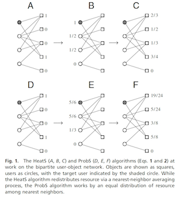
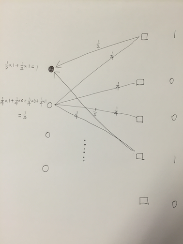
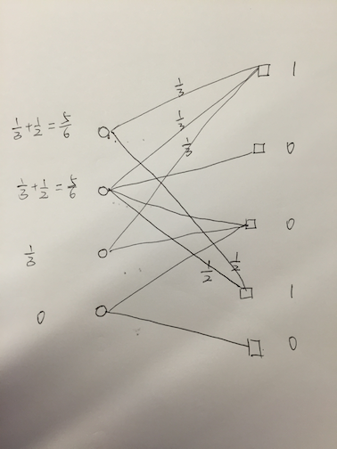
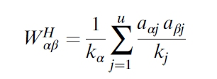
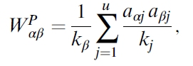
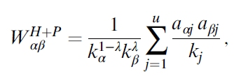

##### 一句话简介
传导算法就是把倾向于热item且注重准确率的ProbS算法和倾向于冷item且注重多样性的HeatS算法的有机结合。

##### 算法效果
某业务线上跑赢了item-cf，这是我们调研此算法的初衷。

##### 图说思想
下面是HeatS(A->B->C)算法和ProbS（D->E->F)，其中“o”表示一个用户，“口”表示一个item，连线表示user喜欢item，下面需要对“●user“给出更多的推荐item。

<br>

##### HeatS
首先是HeatS算法，有些像”吸星大法“，按照均匀比例从源头吸取值。（看带箭头的两条线，源头值是1，但是输出值只有1/2+1/4≠1，所以是非能量守恒算法）

<br>

##### ProbS
然后是ProbS算法，源头按同一比例发散给下游，颇有PageRank的味道，属于能量守恒算法。

<br>

##### matlab
```
% 1.user_item_matrix:
u_i = [
1 0 0 1 0
1 1 1 1 0
1 0 1 0 0
0 0 1 0 1
]

% 2.item_user_matrix:
i_u=u_i'

% 3.user_x's item score:
i1=[
1
0
0
1
0
]

% 4.按照user进行归一化
u_i_norm=u_i./repmat(sum(u_i,2), 1, size(u_i, 2))

% 5.按照item进行归一化
i_u_norm = i_u./repmat(sum(i_u, 2), 1, size(i_u, 2))

% 6.HeatS
i_u_norm*u_i_norm*i1

% 7.ProbS
(i_u_norm*u_i_norm)'*i1
```

##### 迭代公式
<br>

<br>

##### 组合公式
<br>

##### matlab
```
====== HeatS ======
lambda=0
k=[
3
1
3
2
1
]
k_alpha=k.^(1-lambda)
k_beta=k.^lambda
(1./(k_alpha*k_beta')).*(i_u*u_i_norm)

======== ProbS =======
lambda=1
k=[
3
1
3
2
1
]
k_alpha=k.^(1-lambda)
k_beta=k.^lambda
(1./(k_alpha*k_beta')).*(i_u*u_i_norm)
```

A->B->C，然后呢？
因为是要不断迭代，所以要求的是A->B->C->D->...一直到稳定。下面有三种策略：
1. 一直迭代。
2. 幂元加速。（x=2, x^2=4,(x^2)^2=16....)
3. 公式求解。（Ax=x，求x）

##### 具体实现
```
// probS的代码，模仿pagerank写成，还有很大优化空间
// scalastyle:off println

import org.apache.spark.SparkContext._
import org.apache.spark.{SparkConf, SparkContext}

object probS {

  def main(args: Array[String]) {
    /*
    if (args.length < 1) {
      System.err.println("Usage: SparkPageRank <file> <iter>")
      System.exit(1)
    }
    */

    val args = new Array[String](3)
    args(0)="D:\\Users\\spark\\SparkTest\\input\\link.txt"
    args(1)="2"
    args(2)="D:\\Users\\spark\\SparkTest\\input\\node.txt"

    val sparkConf = new SparkConf().setAppName("PageRank").setMaster("local")
    val iters = if (args.length > 1) args(1).toInt else 10
    val ctx = new SparkContext(sparkConf)
    val lines = ctx.textFile(args(0), 1)
    val links = lines.map{ s =>
      val parts = s.split("\\s+")
      (parts(0), parts(1))
    }.distinct().groupByKey().cache()
    //var ranks = links.mapValues(v => 1.0)
    // the init node score
    val nodes = ctx.textFile(args(2), 1)
    var ranks = nodes.map{ s =>
    val parts = s.split("\\s+")
          (parts(0), parts(1).toDouble)
     }
     for (i <- 1 to iters) {
       val contribs = links.join(ranks).values.flatMap{ case (urls, rank) =>
          val size = urls.size
            urls.map(url => (url, rank / (size)))
       }
          //ranks = contribs.reduceByKey(_ + _).mapValues(0.15 + 0.85 * _)
          ranks = contribs.reduceByKey(_ + _).mapValues(0.0 + 1.0 * _)
    }

    val output = ranks.collect()
        output.foreach(tup => println(tup._1 + " has rank: " + tup._2 + "."))

        ctx.stop()
      }
    }

输入文件：
---- node.txt ----
1 0
2 0
3 0
4 0
5 1
6 0
7 0
8 1
9 0

--- link.txt ---
1 5
5 1
1 8
8 1
2 5
5 2
2 6
6 2
2 7
7 2
2 8
8 2
3 5
5 3
3 7
7 3
4 7
7 4
4 9
9 4

// heatS的代码

import org.apache.spark.SparkContext._
import org.apache.spark.{SparkConf, SparkContext}

object heatS {

 def main(args: Array[String]) {
 /*
 if (args.length < 1) {
 System.err.println("Usage: SparkPageRank <file> <iter>")
 System.exit(1)
 }
 */

 val args = new Array[String](3)
 args(0)="D:\\Users\\spark\\SparkTest\\input\\link.txt"
 args(1)="2"
 args(2)="D:\\Users\\spark\\SparkTest\\input\\node.txt"

 val sparkConf = new SparkConf().setAppName("PageRank").setMaster("local")
 val iters = if (args.length > 1) args(1).toInt else 10
 val ctx = new SparkContext(sparkConf)
 val lines = ctx.textFile(args(0), 1)
 val links = lines.map{ s =>
 val parts = s.split("\\s+")
 (parts(0), parts(1))
 }
 val cnt = links.groupByKey.map{ t =>
 (t._1, t._2.size)
 }
 //var ranks = links.mapValues(v => 1.0)
 // the init node score
 val nodes = ctx.textFile(args(2), 1)
 var ranks = nodes.map{ s =>
 val parts = s.split("\\s+")
 (parts(0), parts(1).toDouble)
 }
 for (i <- 1 to iters) {
 ranks = links.join(cnt).map{ t =>
 (t._2._1, (t._1, t._2._2))
 }.join(ranks).map{ t =>
 (t._2._1._1, t._2._2/t._2._1._2)
 }.reduceByKey(_ + _)
 }

 val output = ranks.collect()
 output.foreach(tup => println(tup._1 + " has rank: " + tup._2 + "."))

 ctx.stop()
 }
}

% heatS
(i_u_norm*u_i_norm)^200*i1

ans =

 0.5000
 0.5000
 0.5000
 0.5000
 0.5000


%probS
((i_u_norm*u_i_norm)')^200*i1


ans =

    0.6000
    0.2000
    0.6000
    0.4000
    0.2000
```
heatS会趋于一致，probS会趋于和连接线的个数正相关（即和初始条件无关）

Ref:<br>
http://www.pnas.org/content/107/10/4511.full.pdf